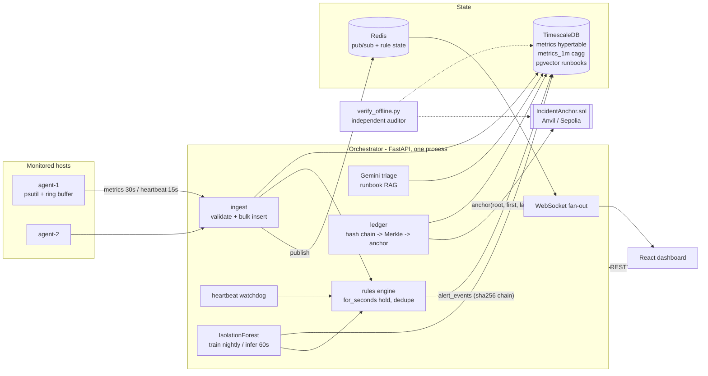

# VIGIL architecture

## Data flow, in one paragraph

Agents sample psutil every 10 s, batch every 30 s (buffering the last 1000 samples on disk
across outages), and heartbeat every 15 s. Ingest validates, bulk-inserts into the `metrics`
hypertable, publishes to `metrics:{observer_id}`, and runs the rules engine, which tracks
first-breach timestamps in Redis to implement `for_seconds` and relies on partial unique
indexes for exactly-one-active-alert semantics. Every alert state change goes through one
lifecycle module that appends a hash-chained `alert_events` row and publishes to the WS bus.
A per-minute job scores the latest `metrics_1m` window with the observer's (or global)
IsolationForest; a 30 s job triages untriaged critical alerts through Gemini with runbook
chunks retrieved from pgvector; a 60 s job folds unbatched events into Merkle batches and
anchors their roots on-chain. The dashboard reads REST and listens to the WS relay of the
Redis bus.

## Trust model of the ledger

| Attacker capability | Detected by |
|---|---|
| Edit an `alert_events` row | its recomputed hash ≠ stored hash → chain + proof fail |
| Edit row *and* its stored hash | `prev_hash` link of the next event breaks |
| Rewrite the whole chain suffix | batch Merkle roots no longer match the on-chain roots |
| Rewrite chain + re-anchor | contract refuses overlapping event-id ranges; old `Anchored` events remain |
| Compromise the orchestrator | `verify_offline.py` needs only a DB dump + RPC URL |

Bootstrap secrets note: compose dev uses Anvil's public dev key and a default admin password —
both are placeholders and must be overridden outside local dev (`.env`).
